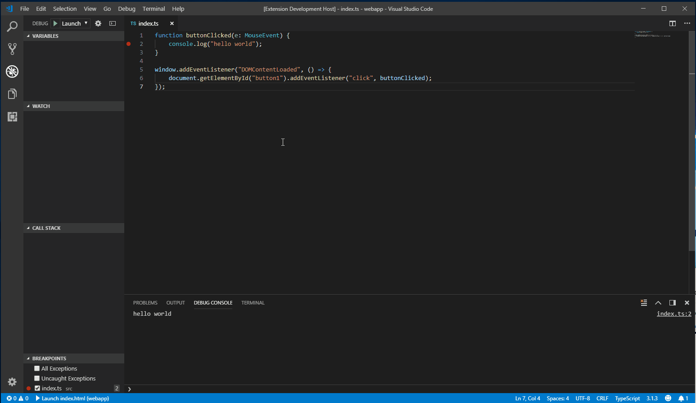

# VSCode DevTools for Chrome

A VSCode extension to host the chrome devtools inside of a webview.

    

# Using the extension
## Launching Chrome manually
- Start chrome with no extensions and remote-debugging enabled on port 9222:
    - `chrome.exe --disable-extensions --remote-debugging-port=9222`
- Open the devtools inside VS Code:
    - Run the command - `DevTools for Chrome: Attach to a target`
    - Select a target from the drop down

## Launching Chrome via the extension
- Start chrome:
    - Run the command - `DevTools for Chrome: Launch Chrome and then attach to a target`
    - Navigate to whatever page you want
- Open the devtools inside VS Code:
    - Select a target from the drop down

# Known Issues
- Prototyping stage
- Settings in the devtools are not persisted
- Chrome browser extensions can sometimes cause the webview to terminate

# Developing the extension itself

- Start chrome with remote-debugging enabled on port 9222
    - `chrome.exe --disable-extensions --remote-debugging-port=9222`
- Run the extension 
    - `npm install`
    - `npm run watch` or `npm run build`
    - Open the folder in VSCode
    - `F5` to start debugging
- Open the devtools 
    - Run the command - `DevTools for Chrome: Attach to a target`
    - Select a target from the drop down

