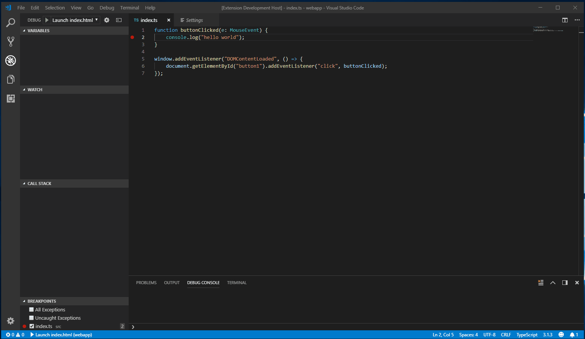

# THIS PROJECT IS NO LONGER UNDER ACTIVE DEVELOPMENT

This was a project that I took on in my spare time to show the potential of having the DevTool embedded directly in VS Code. Unfortunately I no longer have the time to keep this up to date with all the new changes in Chrome, so I am archiving the project and will be removing it from the VS Code marketplace.

However, I think the experiment was a success, and it worked so well in fact, that there is now an officially supported version from Microsoft for the Edge DevTools, which you should check out at the following links:

[Microsoft Edge Developer Tools for Visual Studio Code](https://github.com/microsoft/vscode-edge-devtools)

[Microsoft Edge Developer Tools integration in VS Code](https://docs.microsoft.com/en-us/microsoft-edge/visual-studio-code/microsoft-edge-devtools-extension#browser-debugging-with-microsoft-edge-devtools-integration-in-visual-studio-code)

You can install the Edge version from the [VS Code marketplace](https://marketplace.visualstudio.com/items?itemName=ms-edgedevtools.vscode-edge-devtools)

Thanks to everyone that installed/used/filed issues for this project, and I hope it was useful while it lasted.

# VSCode DevTools for Chrome

A VSCode extension to host the chrome devtools inside of a webview.


<p align="center">
    <a href="https://marketplace.visualstudio.com/items?itemName=codemooseus.vscode-devtools-for-chrome">
        
    </a>
</p>

## Attaching to a running chrome instance:


## Launching a 'debugger for chrome' project and using screencast:


# Using the extension

## Launching as a Debugger
You can launch the Chrome DevTools hosted in VS Code like you would a debugger, by using a launch.json config file. However, the Chrome DevTools aren't a debugger and any breakpoints set in VS Code won't be hit, you can of course use the script debugger in Chrome DevTools. 

To do this in your `launch.json` add a new debug config with two parameters.
- `type` - The name of the debugger which must be `devtools-for-chrome`. Required.
- `url` - The url to launch Chrome at. Optional.
- `file` - The local file path to launch Chrome at. Optional.
- `request` - Whether a new tab in Chrome should be opened `launch` or to use an exsisting tab `attach` matched on URL. Optional.
- `name` - A friendly name to show in the VS Code UI. Required.
```
{
    "version": "0.1.0",
    "configurations": [
        {
            "type": "devtools-for-chrome",
            "request": "launch",
            "name": "Launch Chrome DevTools",
            "file": "${workspaceFolder}/index.html"
        },
        {
            "type": "devtools-for-chrome",
            "request": "attach",
            "name": "Attach Chrome DevTools",
            "url": "http://localhost:8000/"
        }
    ]
}
```

## Launching Chrome manually
- Start chrome with no extensions and remote-debugging enabled on port 9222:
    - `chrome.exe --disable-extensions --remote-debugging-port=9222`
- Open the devtools inside VS Code:
    - Run the command - `DevTools for Chrome: Attach to a target`
    - Select a target from the drop down

## Launching Chrome via the extension
- Start chrome:
    - Run the command - `DevTools for Chrome: Launch Chrome and then attach to a target`
    - Navigate to whatever page you want
- Open the devtools inside VS Code:
    - Select a target from the drop down


# Known Issues
- Prototyping stage
- Having the DevTools in a non-foreground tab can cause issues while debugging
    - This is due to VS Code suspending script execution of non-foreground webviews
    - The workaround is to put the DevTools in a split view tab so that they are always visible while open
- Chrome browser extensions can sometimes cause the webview to terminate

# Developing the extension itself

- Start chrome with remote-debugging enabled on port 9222
    - `chrome.exe --disable-extensions --remote-debugging-port=9222`
- Run the extension 
    - `npm install`
    - `npm run watch` or `npm run build`
    - Open the folder in VSCode
    - `F5` to start debugging
- Open the devtools 
    - Run the command - `DevTools for Chrome: Attach to a target`
    - Select a target from the drop down
